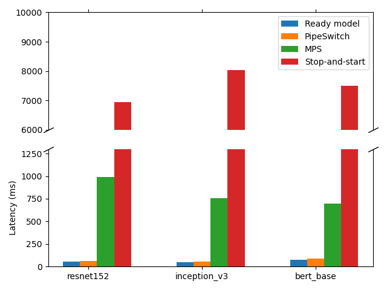

# Reproduce experiment figures

## AWS Setup

All experiments are conducted on AWS. We use two EC2 instance types. One is p3.2xlarge, which is configured with 8 vCPUs (Intel Xeon E5-2686 v4), 1 GPU (NVIDIA V100 with 16 GB GPU memory), PCIe 3.0 ×16, and 61 GB memory. The other is g4dn.2xlarge, which is configured with 8 vCPUs (Intel Platinum 8259CL), 1 GPU (NVIDIA T4 with 16 GB GPU memory), PCIe 3.0 ×8, and 32 GB memory. The software environment includes PyTorch-1.3.0, torchvision- 0.4.2, scipy-1.3.2, and CUDA-10.1.

## Pipeswich Setup 
ssh into your (correctly configured) AWS server, you need to install anaconda first, then create a environment and activate it.
```
conda create --name pipeswitch python=3.6
conda activate pipeswitch
```
Then run the setup script which will install the pipeswitch pytorch\_plugin automatically (you need to run it in this directory). You can read the comments in the script to understand what it does.
```
source setup.sh
```
If the script completed successfully, you will find a new folder pytorch/ under your home directory, this is exactly the pytorch compiled with pipeswitch plugin.
In the script, it sets the PYTHONPATH environment variable for you, but if you log out then re-ssh into the server, you need to add the path to the repo to PYTHONPATH.
```
export PYTHONPATH=[PATH to the repo]:$PYTHONPATH
```
or you may add the above command into your .bashrc file.

## Figure 5 : Total latency experienced by the client for different mechanisms.
To reproduce the figure 5 in paper, run `plot_figure5.py` in this directory (some paths are hard-coded in the script).
```
python plot_figure5.py
```
This script will run four kinds of server (ready model, pipeswitch, MPS, stop-and-start) and compare the latency, i.e. the time between the client send the inference request and the client receive the server's task-finished reply. So it will run several minutes, be patient.
You may see some EOFError message. Don't worry, it is caused by some dirty thread-killing function in the script.
If the script completed successfully, you will find figure5.png in this directory, which looks like the figure below:


### Tips:
- Before you run the script, you may use `nvidia-smi` to check that the GPU is idle, and there is no other process on the GPU, or you may get `File exist` error which indicates the GPU memory is not enough.
- Before you run the script, you may also use `netstat -tlnp|grep 1234` to check there is no other process listening on the same address, or you may get `OSERROR: Address already in use`.For convenience, you can use `netstat -tnlp | grep 12345 | sed "s/.*LISTEN\s*\([0-9]*\).*thon/\1/g" | xargs kill -9` to kill the thread which listen on port 1234.
- You need to have the root priviledge to run the MPS service, see [MPS user guide](https://docs.nvidia.com/deploy/pdf/CUDA_Multi_Process_Service_Overview.pdf) for more details.
## Figure 6 : Throughput and latency under different scheduling cycles for ResNet on p3.2xlarge.

## Figure 7 : Effectiveness of pipelined model transmission.
To reproduce the figure 5 in paper, run `plot_figure5.py` in this directory (some paths are hard-coded in the script).
```
python plot_figure5.py
```
This script only tests the latency for pipeswitch, which uses the pipelining mechanism with optimal model-aware grouping. To get the latency for No optimization/Grouped transmission/Per-layer pipeline, you may modify the pytorch plugin, recompile pytorch then rerun this script. As reference, the latency for pipeswitch is as follows:
[!image-figure7](./figure7.png)

## Figure 8 : Effectiveness of unified memory management.

## Figure 9 : Effectiveness of active-standby switching.
